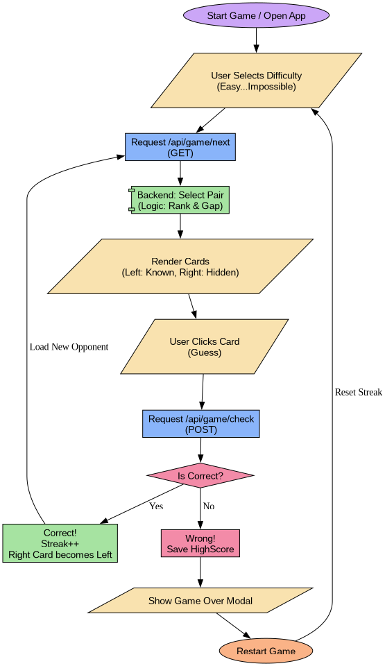

# AnimeGame

реализация включает в себя докер и спринг, реализует игру на выбор какое из аниме популярнее (все локально поэтому проект весит чуть многовато) 

запуск из корня:

```bash
docker-compose up -d --build
```

Приложение доступно по адресу: http://localhost
Шпионская страница: http://localhost/spy.html

## Вопросы

*Зачем нужны Java и докер?*

Java - чтобы поддерживать то что написано на Java, ну и еще язык с кучей фич и функционала

Docker - стандарт индустрии, хорошая архетектура, изоляция, деплой, ну короче чтобы работало если где то то и везде

*Почему вы захотели быть программистом?*

зарабатывать миллион денег в секунду и иметь крутой fedora sway + nvim + qutebroweser чтобы этим вообще почти никто не мог пользоватся

а вообще с самого детства вроде нравилось что то такое, смотрел видеоролики гоши дударя по джаве когда то очень давно, ни сказать что это было полезно но вот

*Почему я ненавижу операционную оболочку Windows и все продукты мелкомягких?*

Ну вообще я почти никогда не пытался программировать на винде, но в целом недавно пытался было больно, но как продвинутая хром ос с играми поддерживать

*Какие интересы у вашего любимого преподавателя?*

я точно помню про нахиду, и про не фурину, и список аниме, еще хельсинг с макимой в репе арча были, сошлюсь на https://github.com/dulcean/java-bsu-2025/pull/61 и https://github.com/dulcean/java-bsu-2025/pull/66


## блок схема



---


